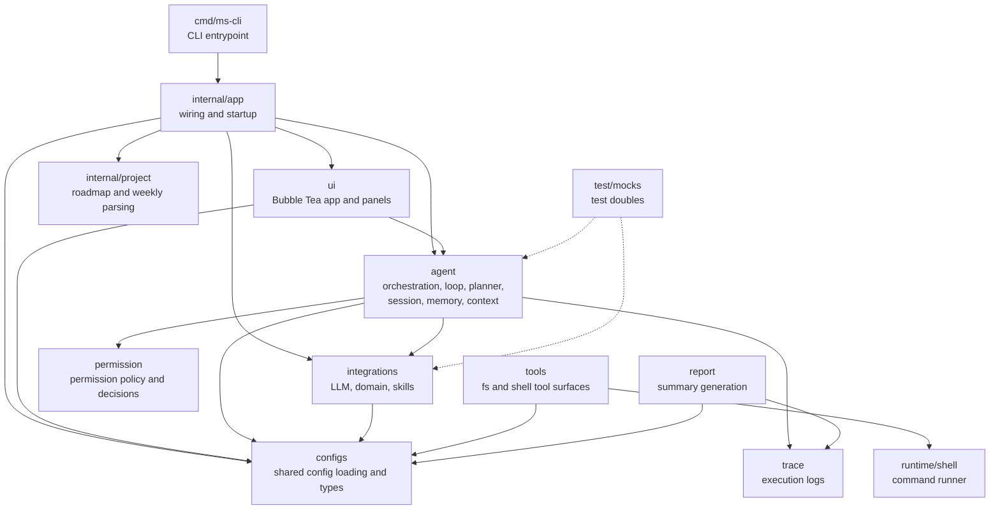

# ms-cli Architecture

This document describes the current repository architecture as it exists in this checkout.

## High-Level View



## Repository Shape

```text
ms-cli/
├── cmd/ms-cli/              # process entrypoint
├── internal/app/            # application bootstrap and wiring
├── internal/project/        # roadmap and weekly status parsers
├── agent/
│   ├── context/             # token budget and context compaction
│   ├── loop/                # core engine interfaces and flow
│   ├── memory/              # memory store, retrieval, policy
│   ├── orchestrator/        # agent mode orchestration
│   ├── planner/             # plan parsing and validation
│   └── session/             # session state and persistence
├── integrations/
│   ├── domain/              # domain client and schema
│   ├── llm/                 # provider registry and OpenAI client
│   └── skills/              # skill repo and invocation integration
├── permission/              # permission types, store, service
├── runtime/
│   └── shell/               # low-level shell runner
├── tools/
│   ├── fs/                  # filesystem tool implementations
│   └── shell/               # shell tool wrapper
├── trace/                   # trace writer
├── report/                  # summary generation
├── ui/
│   ├── components/          # reusable Bubble Tea widgets
│   ├── model/               # shared UI model types
│   ├── panels/              # topbar, chat, hintbar
│   └── slash/               # slash command handling
├── configs/                 # config loading and shared config types
├── test/mocks/              # test doubles
├── docs/                    # project docs
└── examples/                # small runnable examples
```

## Layered Responsibilities

1. `cmd/ms-cli`
   Starts the process and delegates to `internal/app`.

2. `internal/app`
   Composes the application, loads configuration, wires dependencies, and starts the TUI or demo flow.

3. `ui`
   Presents the terminal interface and forwards user intent into the agent-facing flow.

4. `agent`
   Owns the core reasoning loop: session state, orchestration, planning, memory, and execution coordination.

5. `integrations`
   Wraps external systems such as LLM providers, skill repositories, and domain APIs.

6. `tools` and `runtime/shell`
   Execute concrete actions against the filesystem and shell.

7. `permission`
   Centralizes permission levels, decisions, and persistence.

8. `trace` and `report`
   Record execution output and build summaries from those records.

9. `configs`
   Shared configuration types and loaders used across the repo.

## Package Notes

- `agent/loop` is the main execution boundary for engine behavior.
- `agent/orchestrator` appears to sit above the lower-level loop and planner packages.
- `tools/` and `runtime/shell/` overlap conceptually: `tools/` exposes user-facing tool operations, while `runtime/shell/` is a lower-level runner.
- `internal/project/` is separate from the agent runtime and is used for roadmap and weekly update features.
- `test/mocks/llm.go` provides fake LLM behavior for tests.

## Current Reality vs Older Docs

Some repo docs still describe older or planned package names such as `app/`, `executor/`, `workflow/`, or a broader `runtime/` tree. In the current codebase:

- `cmd/ms-cli/` and `internal/app/` replace the older `app/` layout.
- `tools/` contains the current filesystem and shell tool implementations.
- `runtime/` currently contains only `runtime/shell/`.
- There is no top-level `workflow/` package in this checkout.

Use this file as the source of truth for the repository structure until the other docs are updated.
